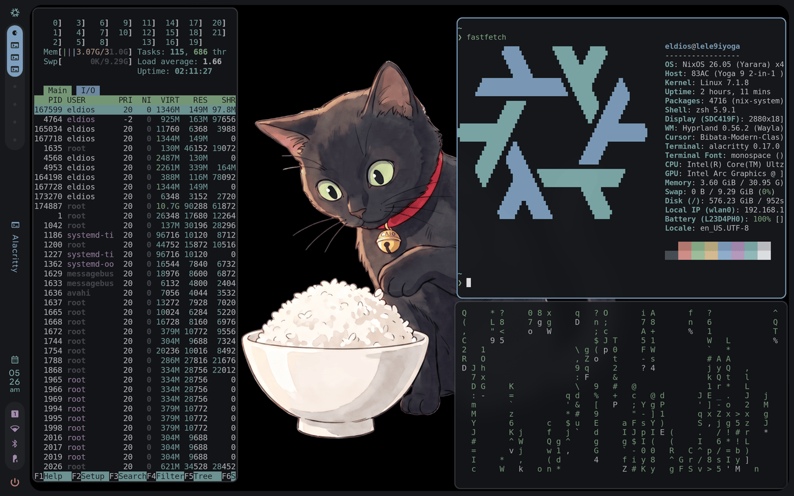

<p align="center">
  
</p>

# caio

riso's example theme, named after its mascot: a deep violet dark with a
lavender accent and cyan glints. Everything a theme can carry is here:

- `colors.toml` - the palette every fragment is generated from
- `hyprland.conf` - hand-tuned window manager styling (borders, rounding)
- `backgrounds/` - five wallpapers of Caio and his bowl of rice
- `preview.png` - what pickers and the catalog show

```bash
riso theme install caio
riso theme set caio
```
